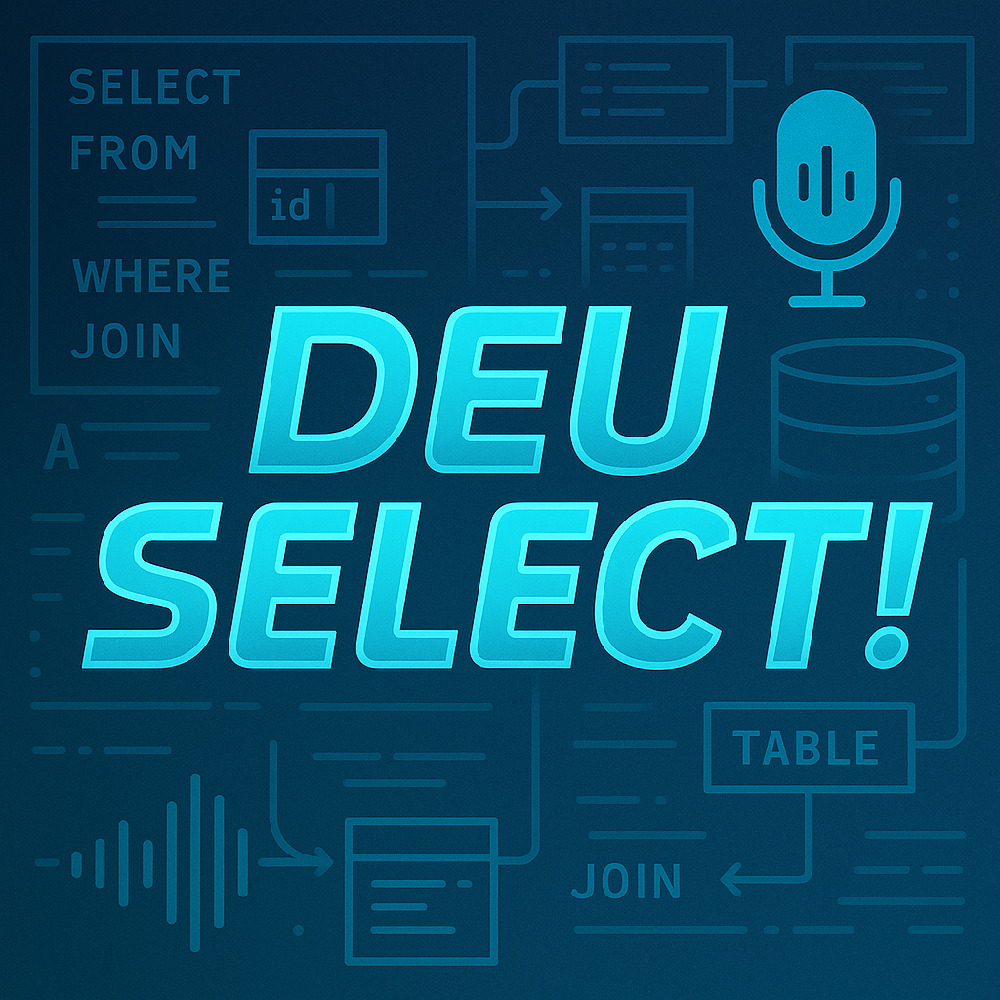

# 🎙️ Deu Select! – Podcast sobre SQL e PL/SQL

Bem-vindo ao repositório oficial do **Deu Select!**, o podcast dedicado a quem vive o dia a dia com SQL, PL/SQL e o mundo dos bancos de dados.

---

## 📌 Sobre o Podcast

O **Deu Select!** é um projeto independente com foco em:

- Dicas práticas de SQL e PL/SQL
- Orientações de carreira na área de dados
- Boas práticas de desenvolvimento
- Bate-papos com profissionais da área
- E, claro... histórias reais de quem já sofreu com uma query mal feita 😄

---

## 🎨 Identidade Visual

**Capa Oficial:**

---

## 📝 Roteiro do Episódio Piloto

O episódio de introdução traz uma visão geral sobre o podcast e o que os ouvintes podem esperar nos próximos episódios.

- Arquivo de roteiro:  
[`scripts/episodio_1_intro.txt`](./scripts/script_txt)

---

## 🎧 Áudio do Episódio Piloto

O áudio do primeiro episódio foi gerado utilizando a ferramenta **ElevenLabs**, com base no roteiro.

- Áudio final:  
[`audio/episodio_1_intro.mp3`](./audio/audio_1ep.mp3)

---

## 🛠️ Prompts Utilizados para Geração de Conteúdo com IA

Aqui estão os prompts usados para criar a identidade visual e o áudio com IA:

- **Prompt para criação da capa:**  
[`prompts/prompt_capa.txt`](./prompts/prompt_capa.txt)

- **Prompt para geração de áudio no ElevenLabs:**  
[`prompts/prompt_audio.txt`](./prompts/prompt_audio.txt)

---

## 💡 Tecnologias e Ferramentas Utilizadas

- **ChatGPT (OpenAI)** – Roteiro e prompts
- **ElevenLabs** – Geração de voz por IA
- **GitHub** – Organização do projeto

---

## 📅 Próximos passos

- Lançamento nos agregadores de podcast (Spotify, Deezer, Apple Podcasts)
- Planejamento dos próximos episódios
- Possível abertura para participação de ouvintes e convidados

---

## 📲 Contato

Para sugestões de pauta ou parcerias:

- [Linkedin](linkedin.com/in/campelogabriell/)

---

## ⭐ Ajude o Projeto!

Se curtir o projeto, deixe uma ⭐ aqui no repositório!

---

> **Na dúvida... Deu Select!**
